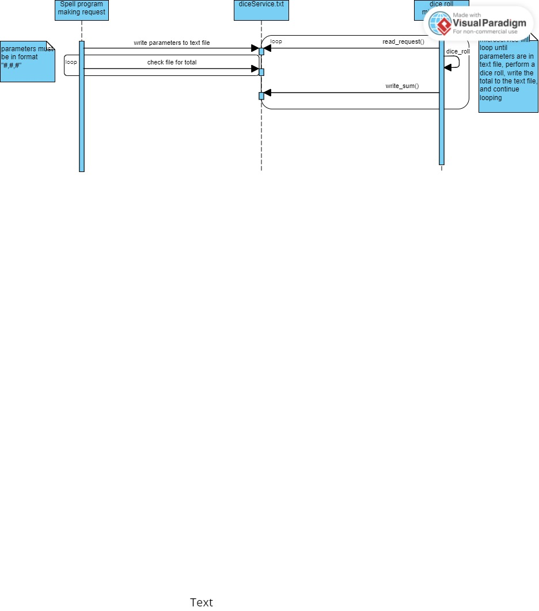

# 361-microservice
Dice roll microservice for partner's project, a program for looking up spells while playing DnD. Microservice recieves three parameters, generates random values based on these parameters, and returns the sum of these values.

Communication Contract:
1. To request data, a string of three numbers written in the format "#,#,#" must be written to the file "diceService.txt". Value 1 will be the number of random numbers to be generated,
   value 2 is the range from which to generate random numbers, and 3 is a final value to be added to the total.
2. diceService.py will write a number to sumService.txt in the form of a string. To receive data, the file "sumService.txt" must be read by the program. 

